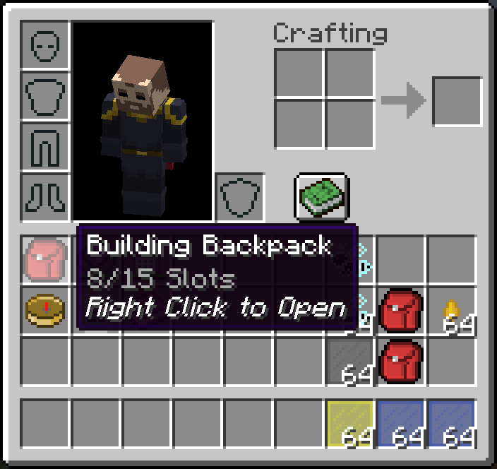
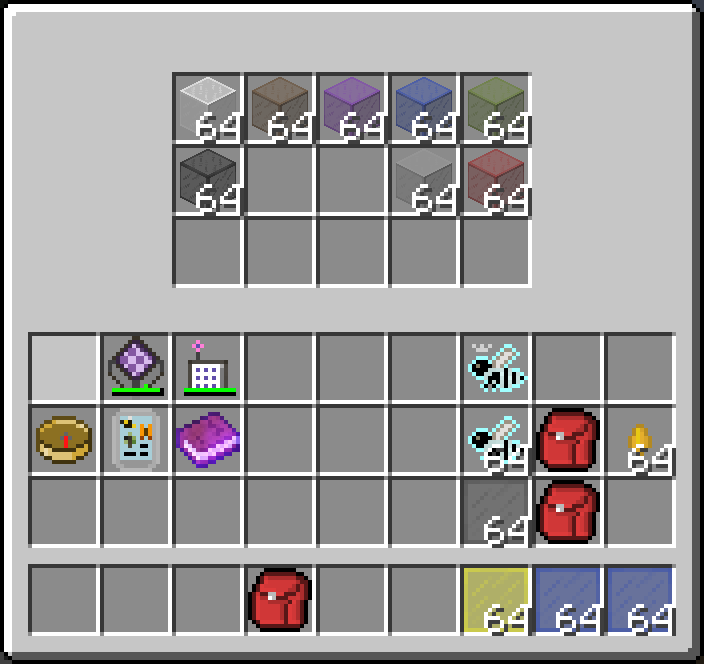

# Backpack Opener
## Overview
A client-side mod to make using handheld GUI items quicker, For example:
- Backpacks
- Wireless terminals
- Books

Open them by simply right-clicking it in your inventory GUI.  
It automatically swaps the item to your active hand and open it. After closing the GUI of item, the item is swapped back and you're back in your inventory.

|Right-click on the item|Opened the GUI|  
|----|----|
|||
## Config
Entries are managed by crafttweaker.

It's suggested to only write entries in a script with `#sideonly client` Preprocessor. Otherwise it will cause errors on dedicated server, because this mod is client only.  

Usage:  
```
// Items to add quick open on, sneak when opening the item
mods.bpopener.BPOpener.addEntry(IIngredient item, boolean sneaking);
```
Example:  
```
#sideonly client
mods.bpopener.BPOpener.addEntry(<minecraft:writable_book>,false);
mods.bpopener.BPOpener.addEntry(<minecraft:written_book>,false);
mods.bpopener.BPOpener.addEntry(<appliedenergistics2:wireless_terminal>,false);
mods.bpopener.BPOpener.addEntry(<appliedenergistics2:portable_cell>,false);
```
## Notes
Don't use this on a server that disallows auto-refill or similar features, unless this mod is explicitly allowed.  